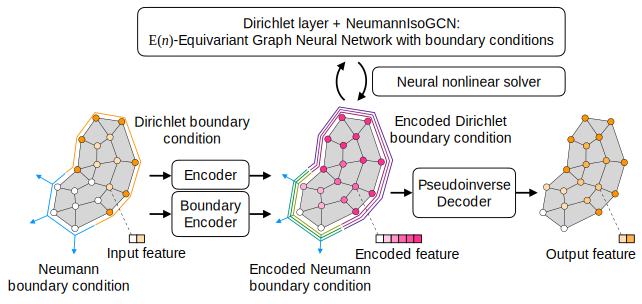

# Physics-Embedded Neural Networks: Graph Neural PDE Solvers with Mixed Boundary Conditions

This repository is the official implementation of a NeurIPS 2022 paper: "Physics-Embedded Neural Networks: Graph Neural PDE Solvers with Mixed Boundary Conditions."


Please cite us as:
```
@inproceedings{
horie2022physicsembedded,
title={Physics-Embedded Neural Networks: Graph Neural {PDE} Solvers with Mixed Boundary Conditions},
author={Masanobu Horie and NAOTO MITSUME},
booktitle={Advances in Neural Information Processing Systems},
editor={Alice H. Oh and Alekh Agarwal and Danielle Belgrave and Kyunghyun Cho},
year={2022},
url={https://openreview.net/forum?id=B3TOg-YCtzo}
}
```

This code is based on the original IsoGCN's code: https://github.com/yellowshippo/isogcn-iclr2021 (including FEMIO (https://github.com/ricosjp/femio) and SiML (https://github.com/ricosjp/siml) as submodules with some modifications), except for `mp-neural-pde-solvers`  based on https://github.com/brandstetter-johannes/MP-Neural-PDE-Solvers.


## Requirements

NOTE: This project requires Python3.9 and CUDA 11.1.

## Clone

This repository uses submodules, so to clone:

```clone
git clone git@github.com:yellowshippo/penn_neurips2022.git --recurse-submodules 
```

### Installation

To install requirements:

```setup
make install
```

Or, if you have no GPUs:

```setup
make install_cpu
```

### Download the gradient dataset

To download the gradient dataset (1.7 GB):

```setup
make grad_data
```

Or to generate dataset:

```setup
make generate_grad
```

NOTE: We do not plan to add a persistent identifier, metadata, and license to this dataset because these data can be generated from the code easily.


### Download the advection-diffusion dataset

To download the advection-diffusion dataset (350 MB):

```setup
make ad_data
```

NOTE: We do not plan to add a persistent identifier, metadata, and license to this dataset because these data can be generated from the code easily.


### Download the incompressible flow dataset

To download the incompressible flow dataset (24 GB):

```setup
make fluid_data
```

NOTE: We plan to add a persistent identifier, metadata, and license to this dataset upon publication.

### Raw data for the incompressible flow dataset
Raw data (OpenFOAM analysis results) are available in (5 GB for each, 303 GB in total):
- https://savanna.ritc.jp/~horiem/penn_neurips2022/data/fluid/raw.tar.gz.partaa
- https://savanna.ritc.jp/~horiem/penn_neurips2022/data/fluid/raw.tar.gz.partab
- ...
- https://savanna.ritc.jp/~horiem/penn_neurips2022/data/fluid/raw.tar.gz.partci

### Pre-trained Models

You can download pretrained models using:

```download
make pretrained_models
```

The downloaded models look as follows:

```bash
pretrained
│   # Models for the gradient dataset
├── grad
│   ├── isogcn  # The original IsoGCN model
│   └── neumannisogcn  # The proposed NeumannIsoGCN (NIsoGCN) model
│
│   # Models for the advection-diffusion dataset
├── ad
│   │   # The proposed model (PENN)
│   ├── penn
│   │
│   │   # Ablation study models
│   ├── wo_boundary_condition_in_nns
│   ├── wo_boundary_condition_input
│   ├── wo_dirichlet_layer
│   ├── wo_encoded_boundary
│   ├── wo_neural_nonlinear_solver
│   ├── wo_pseudoinverse_decoder
│   └── wo_pseudoinverse_decoder_w_dirichlet_layer_after_decoding
│
│   # Models for the incompressible dataset
└── fluid
    │
    │   # The proposed model (PENN) (n: hidden feature size, rep: iteration count)
    ├── penn_n16_rep8  # Reference
    ├── penn_n16_rep4
    ├── penn_n8_rep8
    ├── penn_n8_rep4
    ├── penn_n4_rep8
    ├── penn_n4_rep4
    │
    │   # MP-PDE models (tw: time window size, n: hidden feature size)
    ├── mp-pde_tw20_n128
    ├── mp-pde_tw20_n64
    ├── mp-pde_tw20_n32
    ├── mp-pde_tw10_n128
    ├── mp-pde_tw10_n64
    ├── mp-pde_tw10_n32
    ├── mp-pde_tw4_n128
    ├── mp-pde_tw4_n64
    ├── mp-pde_tw4_n32
    ├── mp-pde_tw2_n128
    ├── mp-pde_tw2_n64
    ├── mp-pde_tw2_n32
    │
    │   # Ablation study models
    ├── wo_boundary_condition_in_nns
    ├── wo_boundary_condition_input
    ├── wo_dirichlet_layer
    ├── wo_encoded_boundary
    ├── wo_neural_nonlinear_solver
    ├── wo_pseudoinverse_decoder
    └── wo_pseudoinverse_decoder_w_dirichlet_layer_after_decoding
```


## Training

### Gradient dataset

To train the NIsoGCN model in the paper, run:

```train
make grad_train
```


To train the original IsoGCN model (baseline), run:

```train
make grad_train GRAD_MODEL=isogcn
```

The corresponding model architectures are written in the following YAML files:

```bash
data/grad
├── neumannisogcn.yml  # NIsoGCN
└── isogcn.yml  # IsoGCN
```


### Incompressible flow dataset

To train the proposed model in the paper (PENN), run:

```train
make fluid_train
```


For the ablation study run in the paper, run:

```train
make fluid_train FLUID_MODEL=model_name
```

The possible options of `model_name` are the following (see Appendix C.7 for more details):

* A: `wo_encoded_boundary`

* B: `wo_boundary_condition_in_nns`

* C: `wo_neural_nonlinear_solver`

* D: `wo_boundary_condition_input`

* E: `wo_dirichlet_layer`

* F: `wo_pseudoinverse_decoder`

* G: `wo_pseudoinverse_decoder_w_dirichlet_layer_after_decoding`


The corresponding model architectures are written in the following YAML files:

```bash
data/fluid
│
│   # The proposed model (PENN) (n: hidden feature size, rep: iteration count)
├── penn_n16_rep8.yml
├── penn_n16_rep4.yml
├── penn_n4_rep8.yml
├── penn_n4_rep4.yml
├── penn_n8_rep8.yml
├── penn_n8_rep4.yml
│
│   # Ablation study models
├── wo_boundary_condition_in_nns.yml
├── wo_boundary_condition_input.yml
├── wo_dirichlet_layer.yml
├── wo_encoded_boundary.yml
├── wo_neural_nonlinear_solver.yml
├── wo_pseudoinverse_decoder_w_dirichlet_layer_after_decoding.yml
└── wo_pseudoinverse_decoder.yml
```


To train the MP-PDE model (baseline), run:

```
make fluid_train_mppde TW=time_window
```

, where `time_window` is the time window size, which can be `2`, `4`, `10`, or `20`.


### Advection-diffusion dataset

To train the proposed model in the paper (PENN), run:

```train
make ad_train
```

For the ablation study run in the paper, run:

```train
make ad_train AD_MODEL=model_name
```

The possible options of `model_name` are the same as these in the Incompressible flow dataset.

The corresponding model architectures are written in the following YAML files:

```bash
data/ad
│
│   # The proposed model (PENN)
├── penn.yml
│
│   # Ablation study models
├── wo_boundary_condition_in_nns.yml
├── wo_boundary_condition_input.yml
├── wo_dirichlet_layer.yml
├── wo_encoded_boundary.yml
├── wo_neural_nonlinear_solver.yml
├── wo_pseudoinverse_decoder_w_dirichlet_layer_after_decoding.yml
└── wo_pseudoinverse_decoder.yml
```


## Evaluation

### Gradient dataset

To evaluate the NIsoGCN model or original IsoGCN model, run:

```eval
make grad_eval PRETRAINED_GRAD_MODEL=path/to/model/directory
```


### Incompressible flow dataset

To evaluate the proposed model (PENN) or its ablation, run:

```eval
make fluid_eval PRETRAINED_PENN_MODEL=path/to/model/directory
```


To evaluate MP-PDE model (baseline), run:

```eval
make fluid_eval_mppde PRETRAINED_MPPDE_MODEL=path/to/model/directory TW=time_window
```


### Incompressible flow dataset (transformed)

To evaluate the proposed model (PENN) or its ablation on the transformed incompressible fluid dataset, run:

```eval
make transformed_fluid_eval PRETRAINED_PENN_MODEL=path/to/model/directory
```

To evaluate MP-PDE model (baseline) on the transformed incompressible fluid dataset, run:

```eval
make transformed_fluid_eval_mppde PRETRAINED_MPPDE_MODEL=path/to/model/directory TW=time_window
```


### Advection-diffusion dataset

To evaluate the proposed model (PENN) or its ablation, run:

```eval
make ad_eval PRETRAINED_AD_MODEL=path/to/model/directory
```


## Results

### Gradient dataset

| Model name               | Command to reproduce                                         | Loss (1e-3) | Neumann loss (1e-3) |
| ------------------------ | ------------------------------------------------------------ | ----------- | ------------------- |
| IsoGCN                   | `make grad_eval PRETRAINED_GRAD_MODEL=pretrained/grad/isogcn` | 192.72      | 1390.95             |
| **NIsoGCN** (Ours) | `make grad_eval `                                            | 6.70        | 3.52                |


### Advection-diffusion dataset

| Model name      | Command to reproduce    | Loss T (1e-4) | Dirichlet loss T (1e-4) |
| --------------- | ----------------------- | ------------- | ----------------------- |
| **PENN** (Ours) | `make ad_eval`          | 1.795          | 0.00                   |


### Incompressible flow dataset

| Model name      | Command to reproduce    | Loss u (1e-4) | Loss p (1e-3) | Dirichlet loss u (1e-4) | Dirichlet loss p (1e-3) |
| --------------- | ----------------------- | ------------- | ------------- | ----------------------- | ----------------------- |
| MP-PDE TW=20    | `make fluid_eval_mppde` | 1.30          | 1.32          | 0.45                    | 0.28                    |
| **PENN** (Ours) | `make fluid_eval`       | 4.36          | 1.17          | 0.00                    | 0.00                    |


### Incompressible flow dataset (transformed)

| Model name      | Command to reproduce                | Loss u (1e-4) | Loss p (1e-3) | Dirichlet loss u (1e-4) | Dirichlet loss p (1e-3) |
| --------------- | ----------------------------------- | ------------- | ------------- | ----------------------- | ----------------------- |
| MP-PDE TW=20    | `make transformed_fluid_eval_mppde` | 1953.62       | 281.86        | 924.73                  | 202.97                  |
| **PENN** (Ours) | `make transformed_fluid_eval`       | 4.36          | 1.17          | 0.00                    | 0.00                    |

## Troubleshooting

Please use a browser and input URLs written in the Makefile if downloads fail.

## License

[Apache License 2.0](./LICENSE).
